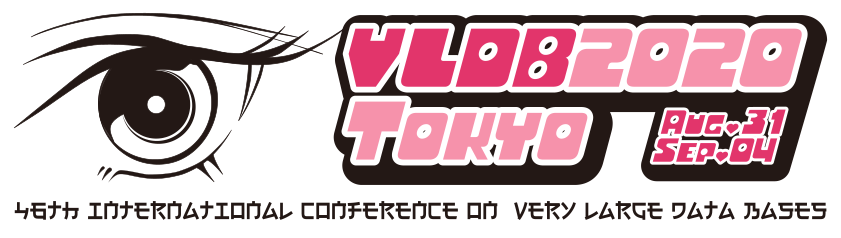

<ul class="fa-ul">
    <li><i class="fas fa-globe-asia"></i><s>Tokyo Japan</s> ONLINE</li>
    <li><i class="far fa-calendar-alt"></i>Monday, August 31 <i class="fas fa-arrow-right"></i>Friday, September 4, 2020</li>
</ul>

VLDB is a premier annual international forum for data management and database researchers, vendors, practitioners, application developers, and users. The VLDB 2020 conference will feature research talks, tutorials, demonstrations, and workshops. It will cover issues in data management,  database and information systems research, since they are the technological cornerstones of the emerging applications of the 21st century.

## VLDB 2020 Updates

    
July 20th

    
Updated! <a href="keynote.html">Keynote Speakers</a>

    
July 07th

    
 <a href="program_timetable.html">Preliminary Conference Timetable</a> is now available.

    
June 30th

    
Updated! <a href="sponsorship.html">Sponsorship Prospectus</a>

