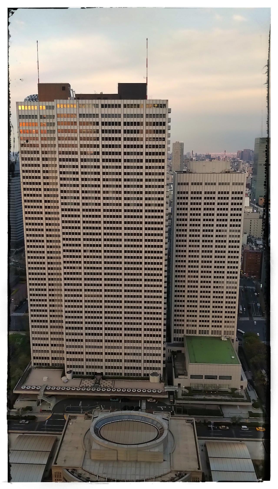

# VLDB2020: Sponsorship Opportunities

    

        

            VLDB 2020 is held at Tokyo, Japan from August 31st to September 4th, 2020. Tokyo is one of the most fascinating cities in the world. In parallel to VLDB 2020, Paralympic Games is held in Tokyo from August 25th to September 6th. We estimate many researchers and students from the world will participate the conference. In the special period, sponsors can meet excellent data architects, practitioners and scientists.
        

        

            VLDB 2020 offers two categories of sponsorships. Basic Sponsors includes Diamond, Platinum+, Platinum, Gold, Silver, and Bronze Sponsors. Special Sponsors includes specific event support, exhibition, etc. VLDB 2020 Sponsorships and Exhibitions Prospectus are available from the following links. Please check the details of sponsorships. Contact info is also included in the documents.
        

        <ul>
            <li><a class="no-barba" href="assets/files/sponsorship_en.pdf">English version</a></li>
            <li><a class="no-barba" href="assets/files/sponsorship_jp.pdf">Japanese version</a></li>
        </ul>
    

        

        
    

